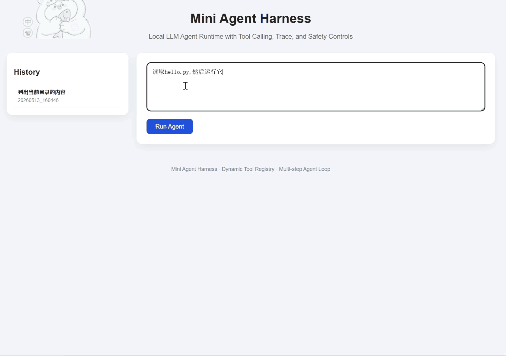

# Mini Agent Harness

A lightweight local LLM agent framework with tool calling, multi-step reasoning, schema validation, safety controls, and execution tracing.

This project implements a lightweight agent runtime inspired by modern AI harness systems.

The agent supports:

- OpenAI-compatible local LLM inference
- Tool calling
- Tool normalization
- Schema validation
- Multi-step agent loops
- Tool error self-correction
- Execution tracing
- Runtime safety controls

The framework is designed for learning and experimentation with agent architectures.

```text
User Input
    ↓
agent.py
    ↓
llm.py
    ↓
normalizer.py
    ↓
dispatcher.py
    ↓
tools.py
    ↓
Tool Result
    ↓
Agent Loop
```

## Project Structure
```text
mini_agent/
│
├── agent.py          # multi-step agent loop
├── dispatcher.py     # tool dispatcher
├── normalizer.py     # tool call normalization
├── schemas.py        # schema validation
├── tools.py          # tool runtime
├── llm.py            # local LLM API wrapper
├── prompts.py        # system prompts
└── README.md
```

## Features

- Multi-step agent execution
- Local LLM integration
- Tool calling
- Tool normalization
- Schema validation
- Tool self-correction
- Dangerous command blocking
- Compact/full execution tracing

## Demo



## Example

User:
```text
读取 abc.txt，如果不存在就创建它，内容为 hello abc
```

Agent Trace:
```text
Step 1: read_file -> failed
Step 2: write_file -> success
Step 3: final_answer
```

Final Answer:
```text
File abc.txt has been created with content: hello abc
```

## Run

Start local LLM server:

```bash
python -m uvicorn server:app --host 0.0.0.0 --port 8000
```

```bash
python agent.py
```
---
## Local LLM Setup

This project uses an OpenAI-compatible local LLM endpoint.

By default, `llm.py` sends requests to:

```text
http://localhost:8000/v1/chat/completions
```
You can start a local server with vLLM, FastAPI, or any OpenAI-compatible backend.

Example with vLLM:

```bash
vllm serve Qwen/Qwen2.5-Coder-14B-Instruct \
  --host 0.0.0.0 \
  --port 8000
```
Then run the agent:
```bash
python agent.py
```

Tool definitions are currently maintained in:
```text
prompts.py
schemas.py
dispatcher.py
tools.py
```

## Dynamic Tool Registry

Tools are defined in `tools.json`.

The same configuration is used to:

- generate tool descriptions in the system prompt
- build argument schemas
- register Python tool functions dynamically

This makes the agent extensible: adding a new tool only requires updating `tools.json` and implementing the corresponding function in `tools.py`.

## Web UI

The project also includes a lightweight FastAPI-based web interface.

Features:

- Chat-style task input
- Execution trace visualization
- Persistent run history
- Dynamic tool runtime
- Local LLM integration
- Runtime safety controls

Run the web UI:

```bash
uvicorn server:app --host 0.0.0.0 --port 7860 --reload
```

Then open:

```text
http://localhost:7860
```
## Architecture

```text
tools.json
    ↓
prompts.py
    ↓
schemas.py
    ↓
dispatcher.py
    ↓
tools.py
    ↓
agent.py
    ↓
Web UI / CLI
```

## Future Work
```md
- Scratchpad reasoning
- Planner/executor architecture
- Parallel tool execution
- Persistent memory
- Background task workers
- Web UI
